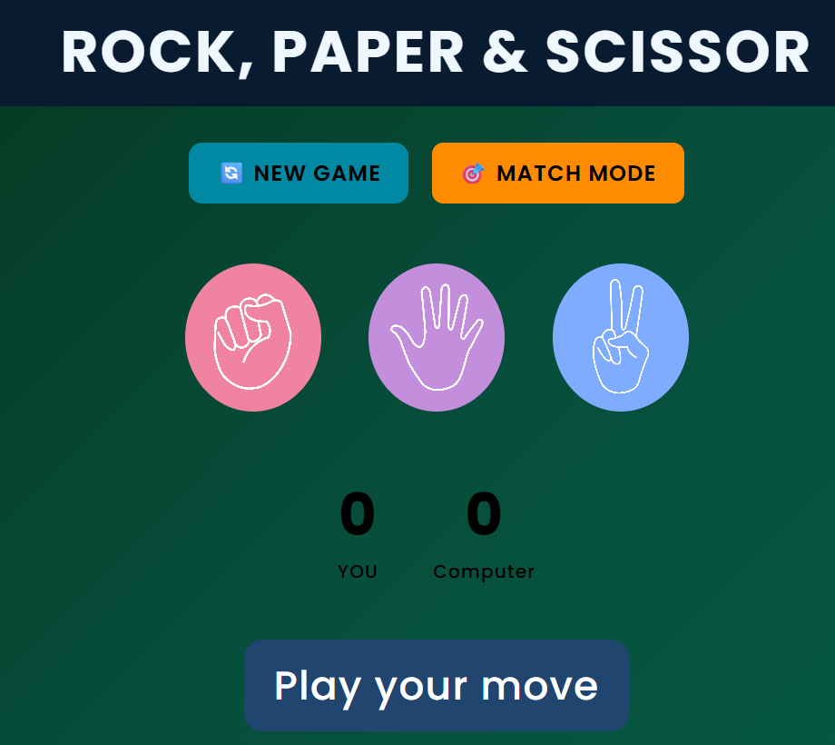

<!-- Anchor for Back to Top -->

# Rock🪨 Paper📄 Scissor✂️ Game

  <em>
    An interactive <b>Rock, Paper & Scissor browser game</b> built using  
    <b>HTML</b>, <b>CSS</b>, and <b>Vanilla JavaScript</b>, featuring  
    <b>Match Mode</b>, animations, and responsive design.
  </em>

---

## 🎮 Live Demo

  <em>
    Play the game live in your browser: 
    🔗 <a href="https://benevolent-liger-849fb2.netlify.app/"><b>Play Rock Paper Scissor</b></a>
  </em>

---

## 📖 Overview

  <em>
    This project is a modern take on the classic <b>Rock, Paper & Scissor</b> game,  
    where a user plays against the computer with real-time score tracking  
    and visual feedback.
  </em>

  <em>
    It includes a special <b>Match Mode</b> where the first player to reach  
    <b>5 wins</b> is declared the overall winner.
  </em>

---

## ✨ Key Features

  <em>
    🎮 <b>Classic Gameplay</b> — Rock, Paper & Scissor rules implemented cleanly.
  </em>

  <em>
    🎯 <b>Match Mode</b> — First to 5 wins takes the match.
  </em>

  <em>
    🎞️ <b>Animated Result Effect</b> — GIF animation displayed before each result.
  </em>

  <em>
    📊 <b>Live Scoreboard</b> — Tracks user and computer scores in real time.
  </em>

  <em>
    🔄 <b>New Game Reset</b> — Restart the game anytime with a single click.
  </em>

  <em>
    📱 <b>Responsive Design</b> — Works smoothly on desktop, tablet, and mobile.
  </em>

---

## 🧰 Tech Stack

  
  
  

---

## 🕹️ How to Play

  <em>
    1️⃣ Click on Rock, Paper, or Scissor. 
    2️⃣ The computer randomly selects its move. 
    3️⃣ The result is shown after a short animation. 
    4️⃣ Scores update automatically. 
    5️⃣ In Match Mode, the first to reach 5 wins wins the match.
  </em>

---

## ⚙️ Core Game Logic

- Computer move generated randomly using JavaScript
- Game rules handled using conditional logic
- Match Mode controlled using score limits
- Modal popup used for Match Mode confirmation
- Animation delay handled using `setTimeout`
- DOM manipulation for real-time UI updates

---

## 🧠 What I Learned

  <em>
    Through this project, I learned:
  </em>

- Handling game states (normal play, match mode, match over)
- Working with modals and overlays
- Using animations to improve user experience
- Managing scores and conditional win logic
- Writing clean and readable JavaScript logic
- Building responsive layouts with CSS media queries

---

## 👤 Creator

  <em>
    <b>Subham Kolay</b> 
    BTech <b>Computer Science</b> Undergraduate & Aspiring Web Developer
  </em>

  <em>
    This project was built independently as part of my journey  
    to strengthen <b>JavaScript fundamentals</b> and interactive UI development.
  </em>

---

## 🚀 Future Improvements

- Smarter AI logic instead of random choice
- Sound effects for wins and losses
- Difficulty levels
- Player vs Player mode
- Persistent scores using localStorage

---

## ⭐ Support

  <em>
    If you enjoyed this project, consider giving it a ⭐ on GitHub.  
    Your support motivates me to keep building and learning!
  </em>

---

  

